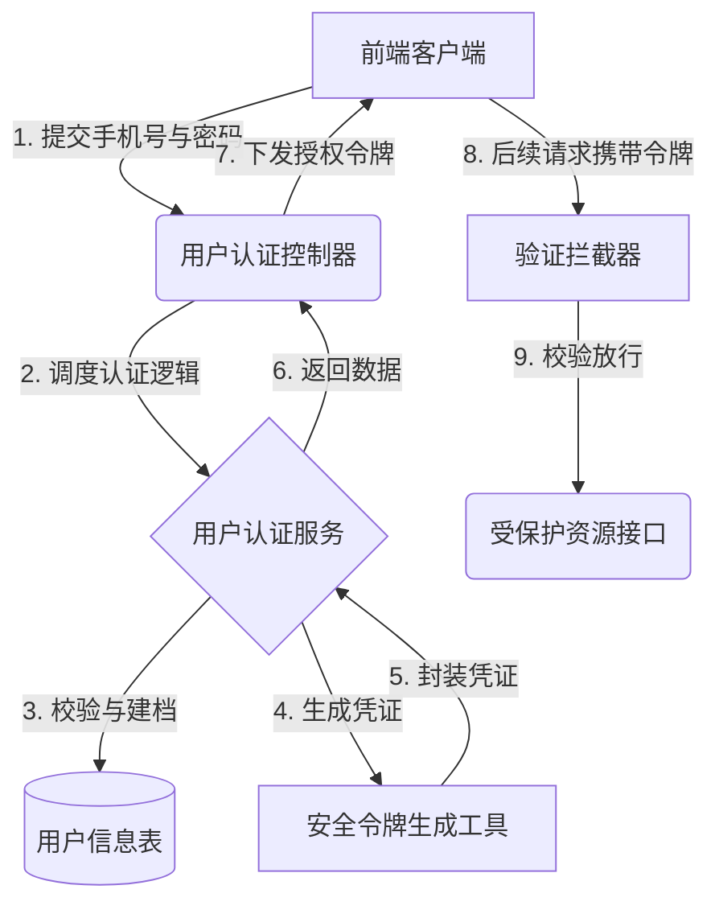
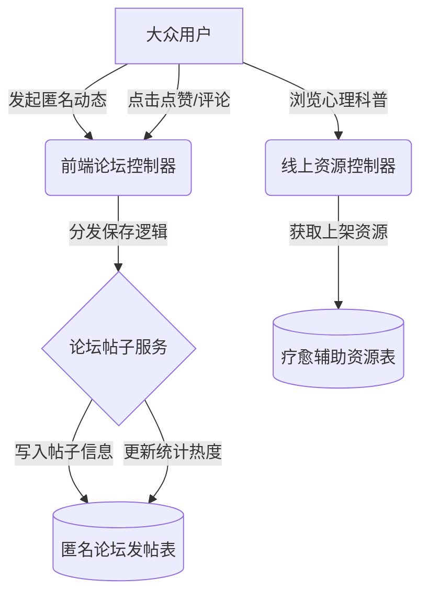
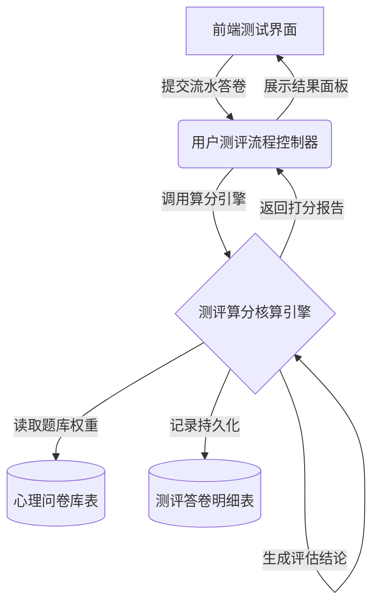
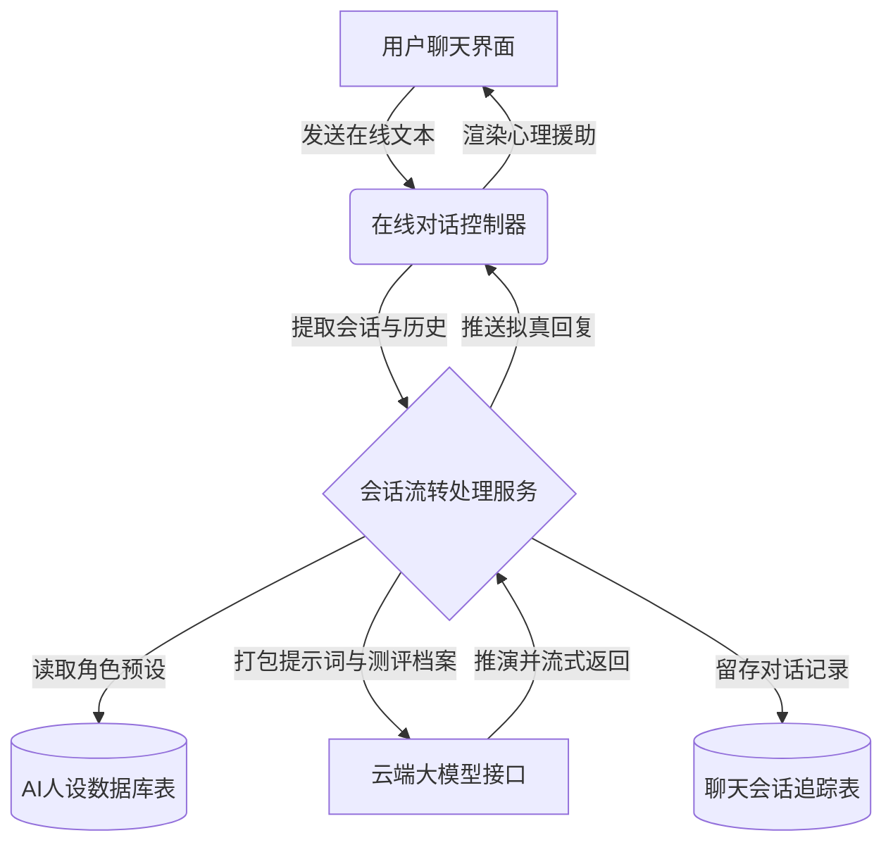
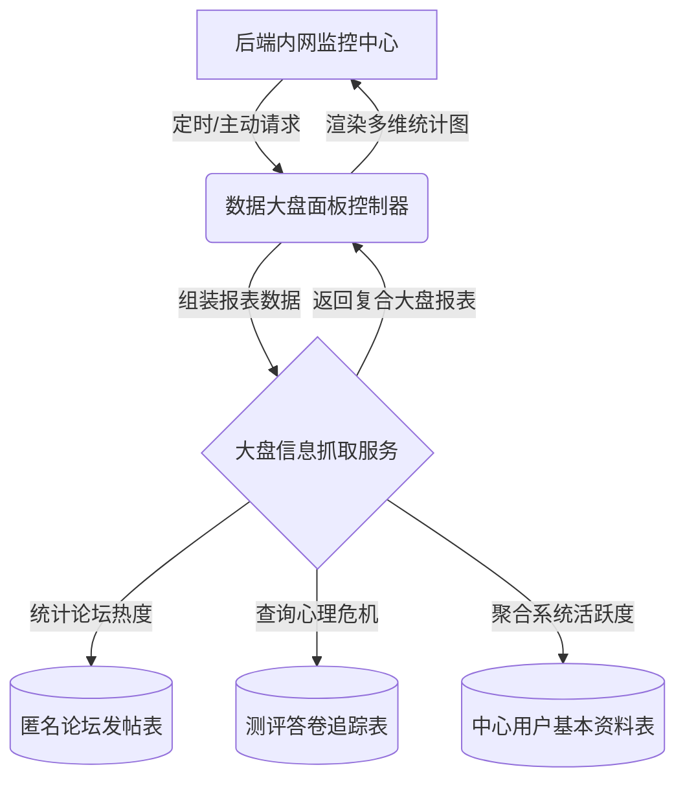
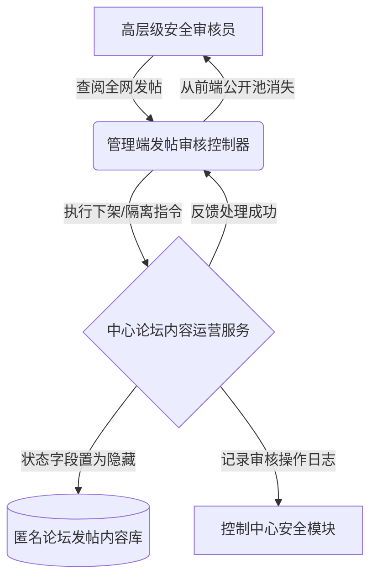
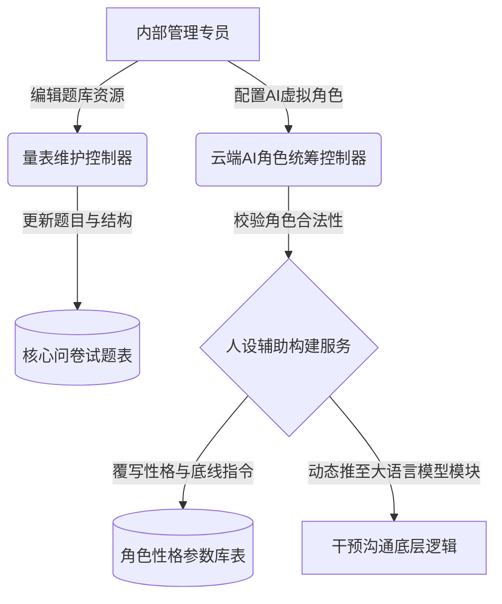

### 摘  要

现如今，随着全社会生活与学习节奏的不断加快，大家所要承受的心理压力也在急剧攀升，随之而来的焦虑与抑郁趋势同样十分明显。但是现实中的心理干预资源分布得非常不均匀，传统的面诊服务体系很难去完全满足海量大众的即时疏导需求。鉴于这种供需极度不平衡的情况，本课题专门去设计并且开发了一套心理健康智能干预系统。

这套系统重点运用了Java语言以及Spring Boot微服务框架来作为后端的服务处理引擎，同时在前端网页展示体系上选用了Vue渐进式框架来搭建界面。在核心的健康管控功能层面，平台不仅去设计了标准化的心理量表问卷测试模块，还把这些收集上来的用户动作数据与社区发帖数据综合到一起进行实时融合打分，要是触碰到了红线数值就会直接去拉响后台的危机预警。平台特别突破性地接入了大语言模型（LLMs）服务接口，大家能够去选择拥有不同性格防线的AI虚拟角色来进行在线陪聊疏导。并且在这个过程中，AI会参考之前用户的评测打分数据动态去生成针对性的诊断报告，通过独有的滑动截断算法使得超长篇幅文本对话也不会出现遗忘的缺陷。

总体来看，这套从线上测试建档到多模态AI陪伴支持的心理服务工作流，极大程度上去丰富了现行心理学教育的介入手段。

**关键词**：心理健康系统；大语言模型；智能干预；Spring Boot；Vue

---

### Abstract

Nowadays, with the accelerating pace of life and study in society, the psychological pressure people have to bear is climbing sharply. However, psychological counseling resources in reality are distributed extremely unevenly, and the traditional face-to-face consultation system is hard to meet the immediate guidance needs of the massive public. In view of this imbalance between supply and demand, this project has specifically designed and developed an intelligent mental health intervention system.

This system mainly utilizes the Java language and the Spring Boot framework as the backend service engine, while adopting the progressive Vue framework to build graphical user interfaces. At the level of core health governance functions, the platform has not only carried out standardized psychological questionnaire modules but also aggregated these collected interactive actions from users for real-time integrated scoring. If the threshold happens to be hit, it will directly trigger the background crisis warning. The platform exceptionally integrates with the large language model APIs. Users could pick AI virtual characters with diverse personalities for online chat guidance. During this flow, AI will consult the user's previously evaluated data to dynamically output targeted diagnostic reports, avoiding memory loss problems via a unique sliding text truncation mechanism.

Overall, this psychological service workflow, ranging from online test archiving to multi-modal AI companion support, has greatly enriched the intervention methods for current psychology education.

**Keywords**: Mental Health System; Large Language Model; Intelligent Intervention; Spring Boot; Vue

---

### 1.1 研究背景与意义

#### 1.1.1 智能心理干预的时代背景
当下，心理健康问题毫无疑问已经变成了整个现代社会的普遍性痛点挑战，尤其是焦虑与抑郁这些负面情绪，在广大学生群体以及职场打工人士等高压圈层当中，表现出了非常显著的上升走向。但是，去面对这种飞速激增的疏导需求时，过往传统的正规心理咨询体系就显得十分力不从心了。这其中主要缘由囊括了专业领域内具有资质的人员极度短缺、单次咨询产生的费用过于高昂，还有线下预约排队流程太过繁琐等因素，这些最终构成了普通大众难以轻易跨越的现实看病门槛。更要命的一点是，有非常多的心理受困扰人员因为担忧自己的个人隐私遭到泄露，或者心底里很畏惧去接受现实中旁人的“眼光评判”，他们往往会选择把痛苦憋在心里默默去忍受，这就直接导致了心理方面的隐患彻底错失最初的最佳干预时间点。

#### 1.1.2 课题的实际应用价值与意义
研发设计这套基于大模型技术的智能心理干预系统，初衷就在于想去填补目前存在的一大截医疗服务缺口。借助自然语言处理这种前沿的技术栈，系统能够为大家撑起一个支持全天候在线、而且完全没有真人评价压力的虚拟倾诉小空间。这套平台具备的核心优势就在于彻底打通了时间与物理空间的双重阻碍，凭借着大家手里基本都有的智能手机这一高普及率硬件终端，让获取心理层面的谈话支持变得触手可及。

对于那些身上只带有一丝轻度心理困扰，或者是正苦苦处于线下诊室预约排队等待期的大众来说，系统操作界面所提供的即时情绪疏导对话功能以及量身定制的应对小策略，既可以用来当作非常高效的短暂过渡期支持手段，也能够被拿来当作是专业医生咨询彻底宣告结束之后的长期家庭辅助监督工具。这种隐匿自身真实身份信息的文字弹框交互方式，极大程度上剥去了大家心底的那层防御装甲，鼓励他们更勇敢地迈出开口向外求助的起步操作。

要是把目光拉长并放到全社会的层面去审视，大力去推广运用此类 Web 平台就不单单是敲黑板展示技术了，它更像是一项去推动底层心理健康服务逐步走向公平化分配的重要举措。它能够很灵活地去覆盖偏远的下沉落后地区，还有那些低收入的弱势务工人群，去极大地缓解优质心理医学资源扎堆在一二线城市这种分布极其不均的社会矛盾。

### 1.2 国内外研究现状

#### 1.2.1 国外心理健康辅助系统应用
国外在心理健康智能干预领域起步较早，且已形成较为完善的实证研究体系。早期研究主要聚焦于基于规则的对话系统与网络自助平台，例如美国斯坦福大学研发的 Woebot 创新性地将认知行为疗法（CBT）融入人机交互中，实证研究表明其通过结构化对话能有效缓解轻至中度的焦虑与抑郁症状[1]。此外，澳大利亚的 MoodGYM 项目作为在线干预的典型代表，通过标准化的自助训练模块，在青少年及大学生群体的焦虑预防与成本效益控制方面取得了显著成效[2]。

尽管各类应用日益普及，但其带来的伦理风险与技术局限性也引起了学界的广泛关注。相关研究强调，在推广人工智能心理干预工具时，必须建立严格的数据治理框架与算法伦理规范，以应对隐私泄露风险及机器缺乏真实共情等核心挑战[3]。为了突破上述局限，近年来的研究热点正逐渐向基于深度学习的大语言模型（LLMs）转移，部分学者致力于利用自然语言处理（NLP）技术深入挖掘文本中的语义特征，以提升系统对复杂情绪的理解能力[4]。同时，新一代研究也开始探索结合自适应学习算法，使系统能够根据用户的语言风格及行为模式动态调整干预策略，从而实现更加精准的个性化服务[5]。

#### 1.2.2 国内大语言模型在心理领域的探索
近年来，国内学者在生成式人工智能视域下，积极探索大学生心理健康教育的新模式，致力于通过技术手段提升心理育人的实效性[6]。针对我国精神卫生医疗机构资源分布不均、专业心理治疗服务供给不足的现状，智能化干预系统的开发显得尤为迫切[7]。研究表明，生成式人工智能在对话中展现出的情绪智能与自我认知引导能力，为心理健康教育提供了创新的技术路径[8]。媒体报道也指出，当 AI 技术与心理健康服务深度融合时，能够有效弥补传统服务的短板，为用户提供更加便捷的支持[9]。

在具体系统设计上，基于劝导式设计理论的大学生心理健康管理服务系统，通过引导性交互增强了用户的依从性[10]。这一系列探索响应了新时代未成年人心理健康服务供给侧改革的要求，旨在从根本上解决服务供需矛盾 [11]。针对部分用户因治疗恐惧而对专业心理求助持消极态度的问题，智能系统的非评判性特点能有效缓解其状态焦虑 [12]。清华大学等高校的实践进一步探索了基于生成式人工智能的人机协同模式，验证了该模式在高校心理服务中的可行性 [13]。

在用户特征与数据应用方面，研究发现青年人的心理健康素养与抑郁、焦虑及失眠症状之间存在显著相关性，这为系统的干预策略提供了理论依据[14]。大数据时代背景下，心理健康档案的数字化建设对于学生心理危机的早期预警具有重要应用价值[15]。数字技术的赋能不仅优化了管理流程，更为高校“师生共育”的心理健康教育实践提供了新的路径[16]。

在技术实现层面，基于 Web 的高职学生心理健康信息管理平台设计，展示了信息化手段在提升管理效率方面的优势[17]。利用社交平台数据构建的大学生抑郁倾向预警模型，进一步拓展了心理危机识别的数据来源[18]。目前，基于 Vue.js 和 Spring Boot 的开发框架已成为构建此类开放式管理平台的主流技术选择[19]。当然，数据安全始终是系统的核心底线，相关研究详细探讨了医疗数据面临的隐私风险及其消减策略 [20] 。此外，针对智能化系统的安全防护，基于微调大语言模型的渗透测试方法也为保障系统安全性提供了新的技术参考[21]。

### 1.3 本课题的主要工作与研究内容

本课题致力于设计并且开发一套心理健康智能干预系统。在这个开发过程当中，核心的工作内容涵盖了前后端分离架构的搭建以及和大语言模型接口的对接工作。

首先运用Java语言和Spring Boot框架来负责后端服务中心的搭建，并且选用Vue框架来开展前端专属页面的渲染工作。在此之上依靠MyBatis-Plus等组件去处理庞大业务数据的持久化保存工作。

在系统的业务层面，主要把重心放在以下功能点。一开始构建了基础用户服务，可以用来处理账号注册以及个人档案基础资料设定等工作。接着开发了心理相关论坛模块，大家能够在这里发布个人树洞状态，也可以浏览系统内部的心理学科普图文。然后还包括量表测评系统，可以引导大家去作答专业问卷，系统会把这些答题结果收集起来并且进行融合算法打分计算，要是发现危险数据就会立刻通知后台触发干预预警机制。

作为整个项目最核心的智能AI干预模块，借助了大语言模型端点的接口调度能力，得以实现包含多种虚拟人格属性的智能陪伴流程。大家可以挑选契合自己当时心境的AI角色来开展深度交流探讨，系统更会通过早前的评测数据来动态生成一份专属心理诊断分析报告，并且会凭借特殊的长文滑动截断算法来让这套超长聊天的系统始终保持上下文记忆。最后，为了让平台平稳运行，还配套开发了负责进行数据实时看盘以及应对违规图文审核的综合管理后台。

### 1.4 论文的章节安排

本篇论文的总体结构脉络如下段落所示。

第一章作为绪论，主要阐释了智能时代背景下开展心理探讨的社会意义，梳理了目前国内外在这个交叉研究领域内取得的发展态势，并明确了本系统需要去完成的具体工作项。

第二章涉及关键技术，详细说明了开发周期当中选用的一系列计算机支撑底座技术。这主要囊括了后端的平台化语言结构、前端页面渲染规则、大模型提示词工程原理还有数据库相关介绍。

第三章属于需求分析环节，分别从大众会员的测评互动参与度，以及特制多角色AI聊天等功能面上开展了细致的业务推导工作，还对系统可能面临的高并发以及隐私文件加密安全等痛点要求进行了分析拍板。

第四章涉及核心逻辑与总体设计，在规划了平台通讯流转机制之后，紧接着针对问卷判题路线、多重动作驱动的叠加健康打分规则以及对话滑动记忆防忘方案进行了深度的算法推演。同时通体梳理了物理数据表之间的映射关联。

第五章系统详细实现部分，会把前一章的设计思路变成了真正的程序代码与落地界面。这里详尽地说明了安全鉴权验证、动态挂载渲染专业问卷图表、AI自动分析病情报告的对接过程以及后台系统动态装填AI性格预置参数的操作细节。

第六章系统测试与评估过程，搭建好系统首发试运行所必备的实际组网网络，并逐一进行了各项主链路功能操作、打分程序极限压力边界以及AI对话角色拟真度的严格抽样测试，随后梳理归档了所有响应性能的评测结论。

### 第 3 章 系统的详细需求分析

#### 3.1 系统核心功能分析

##### 3.1.1 身份拦截与用户基础资料管理
在去审视整套平台的基础门面建设时，首要的任务便是去明确围绕用户本体而展开的一系列身份资料维护需求，正如前端大众操作子系统所展示的那样，必须去构筑出一套极其严密的鉴权过滤门禁。客户端访问与越权拦截控制的完整跳转流程被刻画得十分清晰，如图3.1所示。

    
（此处插入由 Visio 等专用绘图软件绘制的图片：客户端访问与越权拦截控制流程示意图，要求 200dpi 以上，保持长宽比）

    
图 3.1 客户端访问与越权拦截控制流程示意图

这主要是为了防止未登录的外围外部访客直接跨界去读取测试档案等私密信息。同时必定要允许大众很方便地去修改个人头像和个性描述等日常基本信息，在此类需求下构筑了整个底层的前置运行条件。

##### 3.1.2 量表作答与测评结果记录需求
在核心的问卷量表测评业务板块中，要求后端平台去提供标准化的问卷展示版面。这不仅要求前台能去动态地渲染相关的答题选项题目，更关键的地方在于后端必须要能自行去运转一套精确的分数叠加评估程序。程序会把大家在主客观题目里各自积攒下来的得分给无误地归拢起来，生成专属的测评评估得分，如图3.2所示。

    
（此处插入由 Visio 等专用绘图软件绘制的图片：心理量表测评算分与明细录入工作流示意图，要求 200dpi 以上，保持长宽比）

    
图 3.2 心理量表测评算分与明细录入工作流示意图

与此同时，处理侧的程序模块还要自行去把这份成绩单数据提交到系统后端的统一表结构内进行持久化留档，以便于后续相关后台管理员能够非常顺畅地去调取历史测算轨迹开展排查与参考工作。

##### 3.1.3 AI 多人格在线专属干预需求
在整个前后端分离的系统架构体系当中，占比最重且技术门槛最高的业务环节莫过于依靠外部大语言模型驱动的虚拟干预陪聊模块。系统需要对外去开放不同参数预设的 AI 虚拟角色列表，从而供广大受众群体去进行随心所欲地挑选加载。在使用期间，后端程序必须要能自行去把使用者刚刚去考量获取得到的那套打分结果报告当作环境变量，悄悄地去隐式合并成为 AI 开展聊天响应动作的背景大前提。在这之上的明确规定还包括，系统务必需要自行去调度底层长文本滑动截断记忆的计算逻辑，去严防因为对话轮次长时间拉锯而引发历史记录发生惨烈遗忘的技术脱轨错误出现。

##### 3.1.4 科普资源展现与论坛发帖管理需求
为了去切实地增进群体病患相互之间的情绪共鸣，一定不能漏掉去提供一个彻底支持匿名交流支持手段的信息发帖墙。系统覆盖范围内的所有普通访客都能够在互助讨论版块去尽情发表个人的图文生活动态，这部分的业务逻辑与管控权限脉络非常明晰，如图3.3所示。

    
（此处插入由 Visio 等专用绘图软件绘制的图片：平台大众用户端功能权限示意图，要求 200dpi 以上，保持长宽比）

    
图 3.3 平台大众用户端功能权限示意图

除此之外，还务必要去搭配上硬核的专栏精神食粮查阅机制，这主要是由数字科普资源区及辅佐附带的疗愈工具区进行全面支撑，平台内部必须要能够源源不断地去上架涵盖软文文章指导还有能使人平复心情的冥想解压视频音效等疗愈资源选项卡，以此来舒缓大家不经意间产生的那种无所适从的焦躁焦虑感受。

#### 3.2 后台数据审核与大盘管理需求
完全离开系统的外接暴露板块之后，必须着重去提供另外一套界面截然不同的后台管控视图平台板块，好去统管大盘的安全流转状况工作。在这个纯粹的高级安全区内，管理员极其具体的防线工作抓手可以完全参考对应模型，如图3.4所示。

    
（此处插入由 Visio 等专用绘图软件绘制的图片：平台巡查管理员权限架构示意图，要求 200dpi 以上，保持长宽比）

    
图 3.4 平台巡查管理员权限架构示意图

首先去要求能够让相关后台管理人员在全维度的流量大盘区块去居高临下地调阅折线等汇总报表图表。其次，必须去具备专门针对底层服务器性能指标例如 CPU 占用、内存消耗和磁盘运转负担去展开实时嗅探的硬件监控雷达阵列，以防底层架构被庞大数据流给彻底冲垮导致崩溃宕机。在应用逻辑侧，极其坚硬的一项铁律需求是必须具有果敢的违纪审查过滤能力，这牵扯到去把前台涉及违规宣泄的图文论坛贴文去执行立刻隐蔽下架的操作来完成净化线上社区软环境的任务。除此之外，还需要提供一个可以去手工专门化录入虚拟人设专属系统级 Prompt 指令提示词的工作菜单数据通道支撑。

#### 3.3 非功能性与并发需求分析
对于一些不经常直观反映在视图交互上但又是命脉存在的非功能标准方面。首先直接挂钩的核心点就是必须要去考虑大量系统终端都在拥挤调取长连接LLM模型端口所演变出来的网络响应极差甚至服务端口资源耗干情况。它极度要求这后方的接口逻辑务必不能触发请求队列长时间堵死然后最终全盘宕机这种可怕的故障衍生效应。另一项同样不容忽视的准绳就在于无论如何一定要把关于隐秘对话信息的加密留痕处理机制视为铁律防区安全底线，要求那茫茫多涉及到极度个人化状况或者是十分详细私密的问卷隐私填表答案最终录入到物理储存表段里的时候必须实施强密码不可逆地全套转码与加密保护技术。

#### 3.4 系统整体可行性分析
当我们全盘分析并反复演练推演完以上的这些重载和轻载诉求流程后。可以敲定的最终结论是从纯IT开发视角落脚的话此项方案是异常稳妥畅通可达的。系统完全采用了市面最为多见而且技术生态相当完善透明公开的Java和Vue去搭建整个底层支撑台面的主体骨干，然后再由业务逻辑层利用官方认证手段去挂载联通第三方的AI解析提供点，这就根本不存在半途陷入到基础架构缺陷或断供的不可预料深坑状况产生。换回到成本经济测算的着眼点，前期哪怕只能租赁租用到云服务商那最为初始简单的小流量机型主机，在运行测试量较小的雏形状况下同样完全可以极其灵活的周转承担，这些充分匹配极低投入门槛验证特质的操作完全证明其实施建设的理论价值与现实操作落地意义皆已全部具备。
### 第 2 章 关键技术介绍

#### 2.1 后端技术介绍

##### 2.1.1 Java语言概述
在构建本套心理健康干预平台的过程当中，后端服务中心主要是运用Java编程语言来开展底层的逻辑编写工作。Java语言本身拥有非常契合企业级项目开发特性的跨平台运转能力，它所采取的面向对象设计思想可以极大程度上去帮助开发者把复杂的现实业务抽象封装成程序代码。凭借着极为庞大的开源生态以及极其强健的异常拦截捕捉机制，开发人员能够非常安心地把诸多核心的医疗问卷统计算算交由Java底层虚拟机来执行，这也就为整个干预系统日后的长期稳定运转打下了一层厚实的安全底座。

##### 2.1.2 Spring Boot框架
为了进一步去提高服务端代码的编写效率并且降低项目工程初期的构建难度，系统选用Spring Boot微服务框架来作为整体项目的骨架支撑。该框架通过一套约定大于配置的自动化装配体系，把大量以前往往需要手工去逐一填写的繁琐XML文件配置工作彻底给包揽了下来。依托内部高度集成的内嵌式Web容器即Tomcat，整套心理问卷收发以及AI对话接收程序的启动部署动作变得异常干脆利落。另外，它能够与生态当中的安全控制组件或者数据库中间件去开展毫无缝隙的融合工作，极大程度上加快了本课题当中心理数据的流通运转速度。

#### 2.2 前端技术介绍

##### 2.2.1 Vue框架
至于在负责直接与普通大众进行交互的页面展示层面，系统选用了Vue这款当下尤为成熟的渐进式前端框架来开展视图渲染的开发工作。这套框架运用了响应式的双向数据绑定机制，使得当后台下发或者刷新用户的那些心理评估分数数据之时，页面DOM元素便会自动地去进行动态重绘，完全省去了很多手动去操作节点状态的麻烦。并且通过运用组件化封装的设计理念，开发人员能够把类似雷达图图表、心理问卷动态表格还有长文本聊天窗口等高频出现的页面部件给独立剥离出来，极大程度上提高了前端部分代码的实际复用率。

##### 2.2.2 路由与状态管理
在一套前后端完全分离的单页面应用当中，必须要妥善地去处理多个功能页面之间的来回切换控制。因此前端工程结合运用了Vue Router这个官方路由库，它可以把页面URL路径和具体的组件展现无缝地对应起来，实现毫无白屏卡顿感的丝滑跳转体验。同时，在应对像用户的临时登录鉴权口令即Token或者是在做测试问卷中途所打分积累的那部分关键临时数据时，利用具备全局状态共享特性的库来统一开展集中化的调度防伪工作，从而在最大程度上避免了各个松散组件在这期间互相乱传参数所引发的数据混淆问题。

#### 2.3 大语言模型接入技术
本平台最为抢眼的亮点就在于赋予了系统一个能够去读懂情绪的智能内核，而这部分能力的落地则完全仰仗于大语言模型端点接口的应用对接技术。在实际业务流程内部，系统会把那些结构化的心理量表收集结果拼接打包，融合成为一段有着高度定制化倾向的系统背景提示词，然后再把它们通过基于HTTP协议的网络请求发送给云端的大模型推理服务器。由于在开发前期针对请求携带的参数执行了大量精心设计的角色模板配置操作，这就使得最终反馈回来的数据文本能够呈现出极为饱满的人性化拟真情绪响应，极大地增强了虚拟心理陪伴在整个交互层面的治愈感染力。

#### 2.4 数据库技术基础
当谈论到海量心理档案建档以及数不清的用户聊天历史该如何去安全的存储留痕时，关系型数据库技术就起到了一个定海神针般的作用。平台底层架构选用市面上极其成熟的MySQL引擎来充当最终的数据存储仓库基地，它可以支持高吞吐量的事务并发执行。而在后端程序直接去和这套数据仓库进行连通桥接的时候，则是引进了MyBatis-Plus这款异常轻量并且高效的持久层增强操作框架。这款工具由于内置了基础增删改查等现成的功能代码块，能够让接口开发人员把更多宝贵的脑力活动投入到例如雷达得分计算等复杂业务流程的逻辑编写环节当中，而不必去死磕那些毫无技术含量的SQL语句拼接工作。

### 第 4 章 系统核心逻辑与总体设计

#### 4.1 系统整体架构设计
##### 4.1.1 前后端分离架构通信
为实现高内聚低耦合的工程目标，平台整体采用经典的前后端分离技术架构与 MVC 业务分层设计模式。系统自上而下被严密划分为前端展现交互层、控制逻辑拦截层、业务服务执行层、数据访问提取层以及位于根基位置的底层关系型数据库。处于外围系统边界的前端呈现层通过浏览器承接求助者的各类操作，利用异步网络请求包与后方控制中枢进行精准的双向数据交互。后端的控制逻辑层在拦截并解析指令后，会将复杂的分数算法及鉴权真伪校验任务全权委托给业务服务层处理。面对诸如长期留痕存储或多维心理历史档案的穿透提取需求时，该业务层便会直接召唤深层数据访问机制，桥接 MySQL 底层表单库完成高并发下的安全落盘封存。这种界限分明的分层拆分手段，不仅大幅提升了系统抵御安全风险的抗击打强度，同时也极其便利于后续程序的修补与升级，其具体的技术分层控制链路与数据流转走向，如图4.1所示。

    
（此处插入由 Visio 等专用绘图软件绘制的参考图片 1：系统技术分层架构体系与前端控制调用流转示意图，要求 200dpi 以上，保持长宽比）

    
图 4.1 系统技术架构分层体系示意图

##### 4.1.2 平台功能模块划分
在宏观应用功能的块面切割思路上，本系统果断采取了双线并行的物理隔离策略，将整体应用直观地剖分为大众端服务矩阵与内控安全管理阵营。面向承载海量访客的大众客户端侧，系统细致装配了用于验证身份的注册登录模块、囊括减压图文与白噪音的数字资源阅览区、支持抑郁焦虑等权威量表评测考核的打分中心、供访客无压宣泄情绪的匿名互助论坛墙，以及独具特色且多重背景参数可调的 AI 虚拟心理伴侣通道，其大众端服务模块平铺发散结构，如图4.2所示。

    
（此处插入由 Visio 等专用绘图软件绘制的参考图片 2：心理健康平台大众端功能模块树状横向结构图，要求 200dpi 以上，保持长宽比）

    
图 4.2 平台大众端功能模块横向结构图

相对而言的系统总后台控制端，则将全部资源重心倾注于风险预案与基底配置维护。内控区不仅构筑了能够全天候探知服务器吞吐负载表现的大盘监控仪表板，还装配了可针对高危消极贴文执行一键隔离下架的强力干预开关，并专门为管理员预留了用以完善新增量表题库及润色 AI 拟真人设背景语料素材的深层操作端点，其系统内控侧维护模块横截面结构，如图4.3所示。

    
（此处插入由 Visio 等专用绘图软件绘制的参考图片 3：心理健康平台系统内控管理端功能模块树状横向结构图，要求 200dpi 以上，保持长宽比）

    
图 4.3 平台内控管理端功能模块横向结构图

#### 4.2 数据库系统设计
##### 4.2.1 数据库 E-R 概念结构图

要想将前述复杂的业务流转诉求真正落地成型，系统首先必须要去在概念数据模型（CDM）阶段把各个关键参与实体以及它们相互之间的依附关系给明确刻画出来。通过在全局视角下审视心理干预主线流程中的主体、动作与结果数据，平台整体的实体-联系（E-R）关系图展示了这套从建档、测试、交互直到归档打分的宏命令拓扑结构，其全局体系图前文如图4.4所示。

为了避免陷入过于繁杂的底表结构泥潭，在此仅抽出那些真正决定系统大动脉运转的主干业务实体对象进行属性拆解，它们各自承担了最为核心的业务指代使命，各核心实体属性定义梳理如下：

1. **用户实体（User）**
   用户实体专门用来存储前台普通大众会员的基础注册资料、联系方式以及用于雷达评估的健康预警总分等核心系统凭证。该实体包含的属性主要涵盖：用户ID、手机号、密码、昵称、个人头像、当前账号状态、系统创建时间、最近更新时间，以及至关重要的心理健康安全总分。其具体的实体属性结构联系如图4-5所示。

   

       
（此处插入 Visio 绘制的参考图片：用户实体属性图，要求 200dpi 以上，保持长宽比）

       
图 4-5 用户实体属性图

   

2. **管理员实体（Admin）**
   管理员实体主要负责记录系统后台内部各级安全管控人员的登录密码凭证与基本人事档案资料。此实体挂载的核心数据属性包括：管理员ID、登录用户名、加密密码、绑定的角色职责ID、管理员真实姓名、账户启用状态、建档时间以及最后的更新时间戳。其相应的实体结构特征如图4-6所示。

   

       
（此处插入 Visio 绘制的参考图片：管理员实体属性图，要求 200dpi 以上，保持长宽比）

       
图 4-6 管理员实体属性图

   

3. **心理量表实体（Assessment）**
   心理量表实体作为在线测试板块的主干，统筹管理各类专业心理健康测试问卷的表头介绍、归属类型及应用状态。该实体统率下的明细属性罗列为：问卷ID、问卷长标题、导语或问卷详细描述、问卷的当前发布状态、首次草稿创建时间以及内容终审更新时间。其发散状属性关联如图4-7所示。

   

       
（此处插入 Visio 绘制的参考图片：心理量表实体属性图，要求 200dpi 以上，保持长宽比）

       
图 4-7 心理量表实体属性图

   

4. **用户测评记录实体（UserAssessmentRecord）**
   该实体安全留存大众历次参与专业量表作答终结后所生成的评估得分结果与系统深度评语结论。它由以下数个串联业务的关键属性构成：记录流水ID、答题用户的归属ID、所参与测试的问卷ID、评测核算总得分、简略的结果概述结论、深度的评估细则与建议长文本，以及测评执行完毕的确切交卷时间。它在系统内的属性架构体系如图4-8所示。

   

       
（此处插入 Visio 绘制的参考图片：用户测评记录实体属性图，要求 200dpi 以上，保持长宽比）

       
图 4-8 用户测评记录实体属性图

   

5. **论坛帖子实体（ForumPost）**
   持久化储存大众访客在匿名互助社区内公开发布出去的树洞倾诉心得或探讨交流图文内容。构建此社区载体的底层参数属性涉及：发帖流水ID、发帖人用户ID、帖子主题头衔、图文正文内容区块、帖子归类目特征（如情感宣泄或经验分享等）、累计点赞人次数、总计曝光浏览量、帖子当前隐藏或公开状态，外加发帖与二次编辑的时间依据。其直观属性分支布局如图4-9所示。

   

       
（此处插入 Visio 绘制的参考图片：论坛帖子实体属性图，要求 200dpi 以上，保持长宽比）

       
图 4-9 论坛帖子实体属性图

   

6. **虚拟角色实体（AiCharacter）**
   由系统级配置端提供，主要保存可供大众用户选择加载的AI心理陪聊专家的核心提示词及人设档案。它的底层装填属性丰富且具体，分别包括：虚拟角色专属ID、角色的外显称呼名称、人设形象图标Avatar、特定的破冰开场白引导语、厚重的虚拟角色人生经验背景、偏向性性格特点说明、极其严苛的对话底线禁忌法则约束，以及上下架启用标识和数据管理时间参数。关于此实体的各项元素属性如图4-10所示。

   

       
（此处插入 Visio 绘制的参考图片：AI虚拟角色实体属性图，要求 200dpi 以上，保持长宽比）

       
图 4-10 虚拟角色实体属性图

   

7. **聊天会话实体（ChatSession）**
   作为AI陪伴系统的主锚点，负责统领并串联起单个物理用户与特定虚拟AI角色之间展开的纵深在线交流对话箱。该实体涵盖的总括属性包含：会话追踪ID、参与交流的大众用户身份ID、系统借由大模型自动概括出的短精会话标题、正在连线的虚拟AI角色代理ID、聊天室的当前存续冻结状态，以及会话通道最初被开辟和最终被激活回复时的时间锚点。其会话框架属性体系如图4-11所示。

   

       
（此处插入 Visio 绘制的参考图片：聊天会话实体属性图，要求 200dpi 以上，保持长宽比）

       
图 4-11 聊天会话实体属性图

   

8. **疗愈资源实体（InterventionResource）**
   统一化管理系统书架上向外展示的诸如心理科普爆款文章、助眠白噪音音乐甚至冥想等辅助性质的多媒体干预素材。为了支撑多种介质类型展现，它的实体数据包含了：资源专属登记ID、资源的展示标题、资源承载物理种类（如图文、语音段落或视频流等）、文章类型所属的HTML正文源码区块、媒体资源外链URL地址、精美的资源展柜封面图URL地、方便搜索的散装短标签群、粗略简介描述、累计全网阅读听阅点击率量、资源是否可见的安全状态，及相关管理时间配置。其庞杂的多维属性架构逻辑如图4-12所示。

   

       
（此处插入 Visio 绘制的参考图片：疗愈资源实体属性图，要求 200dpi 以上，保持长宽比）

       
图 4-12 疗愈资源实体属性图

   

##### 4.2.2 核心业务物理表设计

在完成全局概念层面的勾勒之后，本系统借助MySQL数据库平台将上述逻辑抽象逐一映射为可供程序代码增删改查的底层物理二维表。为了与前文所确立的八大核心业务实体保持严丝合缝的一一对应关系，在这里特别精选了与之匹配的八张关键业务物理表结构进行详尽的结构化展示。

1. **用户信息表（users）**
   用户信息表主要用于持久化存托平台所有注册访问者的本体数据。该表不仅记录了用户的手机号、加密密码以及个人头像等用于基础登录授权认证的关键字段，更托底存载了与干预评价机制紧密挂钩的整体心理健康分数值，是撑起后续各类功能运转的主力表单。其具体的表结构字段信息，如表4-1所示。

   **表 4-1 用户信息表（users）**
   | 字段名称 | 数据类型 | 长度 | 约束说明 | 备注说明 |
   | :--- | :--- | :--- | :--- | :--- |
   | id | bigint | 20 | 主键，自增 | 用户唯一主键 |
   | phone | varchar | 11 | 唯一，非空 | 手机号 |
   | password | varchar | 255 | 非空 | 加密密码 |
   | nickname | varchar | 50 | 非空 | 用户昵称 |
   | avatar | varchar | 255 | 允许为空 | 头像网络URL |
   | status | tinyint | 4 | 默认1 | 状态：1正常 0禁用 |
   | health_score | int | 11 | 默认100，非空 | 用户心理健康安全分 |
   | created_at | timestamp | - | 默认当前时间 | 记录创建时间 |
   | updated_at | timestamp | - | 自动更新 | 记录最后更新时间 |

2. **管理员档案表（admins）**
   管理员档案表被系统用来划定内控人员的安全准入凭卡。它详细记录了各级巡查维稳干事的登录账户、真实姓名以及当前账户的封停或启用状态，借由此表能严格界定高级风险管理的权限口径边界。其具体的表结构字段信息，如表4-2所示。

   **表 4-2 管理员档案表（admins）**
   | 字段名称 | 数据类型 | 长度 | 约束说明 | 备注说明 |
   | :--- | :--- | :--- | :--- | :--- |
   | id | bigint | 20 | 主键，自增 | 管理员唯一主键 |
   | username | varchar | 50 | 唯一，非空 | 登录用户名 |
   | password | varchar | 255 | 非空 | 加密密码 |
   | role_id | bigint | 20 | 允许为空 | 关联系统角色ID |
   | name | varchar | 50 | 非空 | 管理员真实姓名 |
   | status | tinyint | 4 | 默认1 | 状态：1正常 0禁用 |
   | created_at | timestamp | - | 默认当前时间 | 记录创建时间 |
   | updated_at | timestamp | - | 自动更新 | 记录最后更新时间 |

3. **心理问卷主表（assessments）**
   心理问卷主表是整个测评流转业务的发源点，平台内所有权威下发的健康监测答卷集全部依附于此表中。它存放了各类专业量表的大体标题与导语性细则，直接控制着前端测验问卷的上下架展放情况，为测评诊断活动提供根本库支持。其具体的表结构字段信息，如表4-3所示。

   **表 4-3 心理问卷主表（assessments）**
   | 字段名称 | 数据类型 | 长度 | 约束说明 | 备注说明 |
   | :--- | :--- | :--- | :--- | :--- |
   | id | bigint | 20 | 主键，自增 | 问卷唯一表主键 |
   | title | varchar | 100 | 非空 | 问卷专有长标题 |
   | description | text | - | 允许为空 | 问卷详细描述/指导语 |
   | status | tinyint | 4 | 默认1 | 发布状态：1正常，0下架 |
   | created_at | timestamp | - | 默认当前时间 | 创建时间 |
   | updated_at | timestamp | - | 自动更新 | 最后更新时间 |

4. **测评答卷记录表（user_assessment_records）**
   测评答卷记录表专门负责归档追踪大众用户对各类专业量表的具体作答结算轨迹。它深度维系了参与者与问卷间的每次动作结果，不仅记下了最后结算出来的雷达算分总分数值，更把机器判出来的详细长篇评估细则和指导语原样封存了下来。其具体的表结构字段信息，如表4-4所示。

   **表 4-4 测评答卷记录表（user_assessment_records）**
   | 字段名称 | 数据类型 | 长度 | 约束说明 | 备注说明 |
   | :--- | :--- | :--- | :--- | :--- |
   | id | bigint | 20 | 主键，自增 | 答题记录流水号主键 |
   | user_id | bigint | 20 | 外键约束，非空 | 对应作答的大众用户ID |
   | assessment_id | bigint | 20 | 外键约束，非空 | 对应所测心理问卷库ID |
   | total_score | int | 11 | 非空 | 本次测评最终总得分核算 |
   | result_summary | varchar | 100 | 允许为空 | 分数结论总括概述 |
   | result_details | text | - | 允许为空 | 深度评估详细建议与评语 |
   | created_at | timestamp | - | 默认当前时间 | 答卷落盘封存建档时间 |

5. **匿名论坛发帖表（forum_posts）**
   涵盖大众在线上社群环节中所交流产生的所有图文树洞信息流，均全套入库沉淀于匿名论坛发帖表之中。该表不仅囊括了正文数据以及帖子对应的划分维度，还持续更新统计诸如点赞、阅览量等交互热度指标点，随时接受系统防线大盘的净化探查审查。其具体的表结构字段信息，如表4-5所示。

   **表 4-5 匿名论坛发帖表（forum_posts）**
   | 字段名称 | 数据类型 | 长度 | 约束说明 | 备注说明 |
   | :--- | :--- | :--- | :--- | :--- |
   | id | bigint | 20 | 主键，自增 | 发帖数据流水主键 |
   | user_id | bigint | 20 | 外键级联，非空 | 发表贴文的用户ID |
   | title | varchar | 200 | 非空 | 帖子主标题 |
   | content | text | - | 非空 | 富文本正文内容区 |
   | category | enum | - | 默认'emotion' | 分类（情感宣泄/经验交流） |
   | like_count | int | 11 | 默认0 | 收到同行点击点赞数 |
   | view_count | int | 11 | 默认0 | 该贴累计整体曝光游览量 |
   | status | tinyint | 4 | 默认1 | 防线审查状态：1正常 0下架 |
   | created_at | timestamp | - | 默认当前时间 | 帖子成功推向论坛库时间 |
   | updated_at | timestamp | - | 自动更新 | 贴文最后编辑时间 |

6. **AI角色人设装配表（ai_character）**
   AI角色人设装配表可以说是平台智能驱动层的大动脉，系统内置虚拟陪伴聊天模型所需的各项性格基因，全部都会硬性刻板记录在此表内。这里面不但写明了各类角色的人物外显破冰语及身世背景参数，更是直接装配着对接LLM大模型端点时的那极其严苛的对话底线禁忌法则，是平台能去提供多角色高拟真AI服务的稳定基础。其具体的表结构字段信息，如表4-6所示。

   **表 4-6 AI角色人设装配表（ai_character）**
   | 字段名称 | 数据类型 | 长度 | 约束说明 | 备注说明 |
   | :--- | :--- | :--- | :--- | :--- |
   | id | bigint | 20 | 主键，自增 | 虚拟角色数据库ID键 |
   | name | varchar | 50 | 非空 | 角色前台展示名称 |
   | avatar | varchar | 255 | 允许为空 | 角色虚拟头像或Icon源 |
   | greeting | varchar | 200 | 允许为空 | 专属破冰寒暄开场白 |
   | background | text | - | 允许为空 | 虚拟厚重人设经历背景库 |
   | personality | text | - | 允许为空 | 规定性格基调及语气辅加词 |
   | rules | text | - | 允许为空 | 控制禁忌越界行为及应激原则 |
   | is_active | tinyint | 4 | 默认1 | 是否提供选取：1是，0否 |
   | created_at | datetime | - | 默认当前时间 | 该预置参数角色建库时间 |
   | updated_at | datetime | - | 自动更新 | 参数后期润色再编辑时间 |

7. **智能聊天干预会话主表（chat_sessions）**
   智能聊天干预会话主表主要被用来去统领及管理每个用户独立发起的、指向某一位AI专属导师的房间记录以及周期连接窗口控制状态。它好比是对线会话的顶层分流网关抽屉，不仅标识出了目前具体连外的大语言模型虚拟人设ID，还保存了经过AI处理总结出来的本轮度沟通的精简提纲短标题等主干会话脉络。其具体的表结构字段信息，如表4-7所示。

   **表 4-7 智能聊天干预会话主表（chat_sessions）**
   | 字段名称 | 数据类型 | 长度 | 约束说明 | 备注说明 |
   | :--- | :--- | :--- | :--- | :--- |
   | id | bigint | 20 | 主键，自增 | 聊天会话包裹ID唯一键 |
   | user_id | bigint | 20 | 索引，非空 | 发起提问的大众用户ID |
   | title | varchar | 200 | 默认'新的对话' | 系统提炼的会话内容摘要题头 |
   | character_id | bigint | 20 | 默认1 | 绑定的对应陪聊AI人设模型ID |
   | status | tinyint | 4 | 默认1 | 连接线存续状态：1正常 0移除 |
   | created_at | timestamp | - | 默认当前时间 | 该会话房间初次打通时间 |
   | updated_at | timestamp | - | 自动更新 | 会话窗内发生交互变更时间 |

8. **干预辅助疗愈资源表（intervention_resources）**
   干预辅助疗愈资源表担负着整个平台心理干预资源的外部陈列展台等功能，它极为广泛地涵盖并统筹了系统外扩式的各类软文科普文章以及诸如呼吸减压等辅助媒体影音库项。由于这里面往往会混杂着大量富文本的HTML外壳代码亦或者是外链分发的特定音视频播放流媒体矩阵源，它这从极深的数据物理层面上直接为整个平台建立强大的心理初筛平复弹药库及多媒体疏导干预底座起到了不可替代的数据基桩加固作用。其具体的表结构字段信息，如表4-8所示。

   **表 4-8 干预辅助疗愈资源表（intervention_resources）**
   | 字段名称 | 数据类型 | 长度 | 约束说明 | 备注说明 |
   | :--- | :--- | :--- | :--- | :--- |
   | id | bigint | 20 | 主键，自增 | 多媒体疗愈资源唯一标识ID |
   | title | varchar | 200 | 非空 | 资源长标题展示名 |
   | type | varchar | 20 | 索引，非空 | 媒介类型（图文/音频/视频） |
   | content | text | - | 允许为空 | 用于渲染文章的高阶HTML正文 |
   | resource_url | varchar | 500 | 允许为空 | 外链分发音频或流媒体视频播放源 |
   | cover_url | varchar | 500 | 允许为空 | 资源展柜封面海报海报图 |
   | tags | varchar | 200 | 允许为空 | 便于查找的散装短向词缀标签 |
   | description | varchar | 500 | 允许为空 | 通篇资源简介速览文案 |
   | view_count | int | 11 | 默认0 | 实际累计受访收听阅读量 |
   | status | tinyint | 4 | 默认1，索引 | 是否允许曝光状态：1上架 0下架 |
   | created_at | datetime | - | 默认当前时间 | 本条目初始投递入库时间 |
   | updated_at | datetime | - | 自动更新 | 资源内文被查验再更新编辑点 |

#### 4.3 用户端功能详细设计

##### 4.3.1 用户注册登录权限流
用户注册登录权限流负责平台外围边界的安全准入控制。大众用户首次访问时需通过手机号与密码进行注册建档，随后系统会进行身份校验并下发高强度的鉴权 Token 令牌。前端应用在成功接收到 Token 后会将其进行本地化持久缓存，在后续所有涉及获取个人隐私数据（如测评档案、聊天记录等）的隐秘网络请求中均需在头信息里携带此凭证，以顺畅通过后端跨域与安全中心鉴权拦截器的严格验证审查，其具体的用户注册登录权限流转动作走向，如图4-13所示。

    
图 4-13 用户注册登录权限执行流程图

##### 4.3.2 匿名倾诉论坛与科普模块
该模块主要旨在向病患提供无需承受社交压力的多维情绪宣泄以及自我调适的数字避风港。使用者可以在此以彻底匿名化的身份对外发布极度个性的树洞图文动态，并且支持在主线评论区相互进行点按点赞和评论交流；此外，模块内还并列设立了涵盖官方下发的心理学科普文章及多媒体视听等减压指导物料干预库，引导受众去快速挑选并获取疗愈指导，平复偶然间的情绪波动，其具体的匿名倾诉论坛与数字资源操作流转走向，如图4-14所示。

    
图 4-14 匿名倾诉论坛业务流转设计图

##### 4.3.3 心理量表测评算分机制
量表测评算分机制是平台捕捉与判定个人客观心理危急状态的核心探测通道。当用户在授权进入特定的权威测试问卷（如 SDS 或 PHQ-9）按规定进行选项填涂交卷后，服务端内置算法便会自动去根据预设的每道题算分权重逻辑进行换算叠加，结合标准换算规则打通分数换算程序；最终生成该次记录的总得分并归类出严重评估定级将其持久化封存落盘，成为日后平台发起干预报警与参考定损的重要抓手，其具体的心理量表测评算分逻辑与数据归档走向，如图4-15所示。

    
图 4-15 心理量表测评算分逻辑运作流程图

##### 4.3.4 AI 虚拟角色干预对话流
作为整个智能应用最前驱的情感陪伴运转枢纽，对话流支撑着处于高压防线下的访客与各色定制化 AI 导师间的长程文字通信流转。访客端每次抛出的文字提问经过后台获取后，系统底层即刻会依靠滚动摘要记忆过滤框架对其发起上下文提取；在强行合并调取出对应专属 AI 身份人物设定的严格道德边界红线防御条款与指导预设语录后，将这些包裹密实的一体化数据通过 API 转送大模型推演节点，以反馈给求助者极具拟真与共情感受的安全心理支援文字串，其具体的AI虚拟角色多维状态在线干预交互执行走向，如图4-16所示。

    
图 4-16 AI虚拟角色在线干预交互流程图

#### 4.4 管理端功能详细设计

##### 4.4.1 服务器大盘数据监控
服务器大盘数据监控模块旨在为身处后台内网的安全维稳专员提供实时探测项目整体运转脉络的汇总展示报表台。该监控应用会通过微服务监控数据对整个站点的每日流量以及活跃态势展开统计追踪，直面并呈现全平台匿名发帖情感趋势检测走向信息汇总、以及触发危机求救打分预警的用户总览群落结构；利用各类直接可视化的面板和饼状图等，有效地协助运营审核团队快速察觉平台承受的各类业务异常或大规模负面消极情绪波动隐患，其具体的服务器大盘监控与异常数据统计流转走向，如图4-17所示。

    
图 4-17 服务器大盘监控统计流转图

##### 4.4.2 违规帖子隔离下架处理
为硬性预防前方大众图文树洞遭受含有恶质泄压宣泄等违规垃圾发帖干扰污染，此模块专门构筑了一道专由高层级安全审核员去执行彻底隐藏阻断控制权限的手动锁定清退功能。透过全网发帖列表的系统后台界面面板查阅核实后，相关执纪人员只要利用预置审核处理操作即能立即使得某篇确凿涉嫌触及底线的过激文本从公开流量曝光池中彻底隐身下架过滤，坚决维持住医疗健康社区软文化氛围的基础底盘生态运转红线，其具体的社区发帖审查与违规隔离下架动作走向，如图4-18所示。

    
图 4-18 社区发帖审核与违规下架处理动作图

##### 4.4.3 题库资源与 AI 人设管理
题库资源与 AI 人设管理核心功能区块专门用于赋予具有强干预权限管理员去随时向系统内网注入并修改各类核心导引辅助材料与陪伴智库规则的能力。内部管理专员基于业务扩展需要，可在这一通道自主完成关于量测题干和下级答案配置选项表头的发布修改；最为特殊的应用权限莫过于通过配置系统直拨篡改各色AI虚拟陪诊者的角色背景指令字典和必须回避的不当话题法则警戒词条防线预设，以此达成从逻辑源头动态升级优化大模型陪聊专业辅助功效的长久管控设计理念，其具体的疗愈题库维护与AI角色属性动态注入走向，如图4-19所示。

    
图 4-19 疗愈题库维护与AI预设角色动态管理流向图

